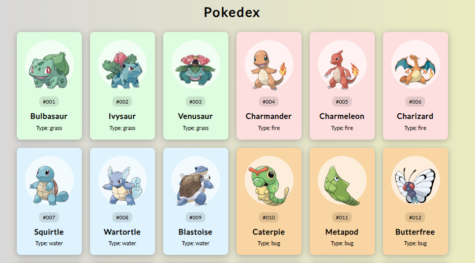

# API_N3_Pokedex

## PEDAGOGICAL OBJECTIVE  
- Learn fundamental knowledge and skills to interact with APIs, and obtain data in JSON format
- Handle GET requests
- Apply the concept of asynchronism
- Manipulate objects
- Manipulate the DOM

## CONTEXT / NEED
This is a project in which an API is consumed that contains Pokemon and displays them in the form of cards.

## Process 
### Tecnologies
For this project I used the technologies requested:

 

### Result

## Installations Steps
1. [Clone](https://docs.github.com/en/repositories/creating-and-managing-repositories/cloning-a-repository) the repository.

2. Open the proyect in Visual Studio Code ( is a source code editor developed by Microsoft for Windows, Linux, macOS and Web).

3. Enjoy it.

## Author
created with 💜 by [NathaRuiz](https://github.com/NathaRuiz)

